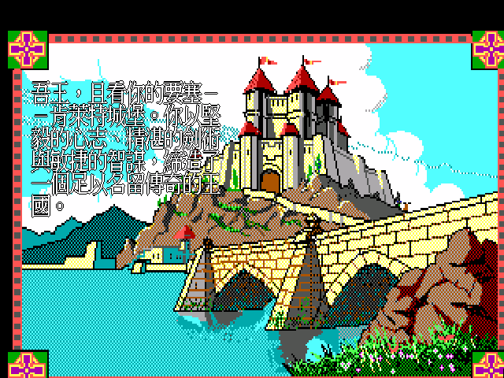
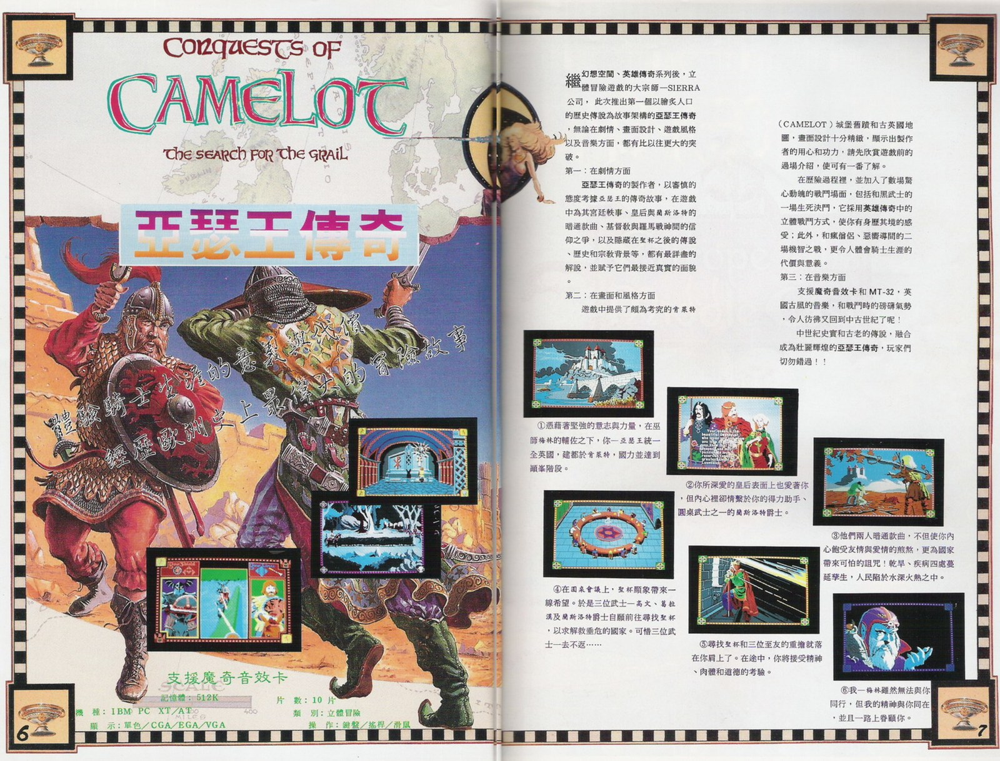

# 亞瑟王傳奇 — 尋找聖杯　繁體中文化

*Conquests of Camelot: The Search for the Grail*（Sierra On-Line, 1990）

你是亞瑟王。不列顛在你手中統一了，好日子卻沒有跟著來——旱象蔓延，疫病四起，
田裡長不出東西，人民在城牆外挨餓。宮廷裡的說法是：唯有找回聖杯，這片土地才能解咒。
高文、葛拉漢、蘭斯洛特三位圓桌武士先後出發尋訪，至今下落不明。

你心裡清楚詛咒從哪裡來。皇后昆海兒與蘭斯洛特之間的事，你早就知道了。
沒有人能代你去。你得親自上馬，穿過派瑞樂斯森林，渡過地中海，
一路走到耶路撒冷的城門下——把三位騎士找回來，把聖杯帶回來。

這個專案把這條路上的每一句話翻成繁體中文：**4554 則對白與敘述**、選單、道具欄、
技能／智慧／靈魂三種分數的畫面。譯名以 **1990 年《軟體世界》第 18、19 期的攻略**為準，
用的是當年台灣玩家看到的名字——肯萊特、昆海兒、葛拉漢。字形直接取自
**倚天中文系統的原生點陣字**，不是現代字型縮小的；螢幕上看起來就是 1990 年代的中文 DOS 遊戲。

本專案**只提供 ScummVM 引擎修改與中文資料，不含任何遊戲檔案**，你需要自備正版遊戲。
想直接玩，跳到〈[怎麼玩](#怎麼玩)〉。

---

## 目錄

- [當年在台灣](#當年在台灣)
- [譯名是怎麼定的](#譯名是怎麼定的)
- [這是 parser 遊戲](#這是-parser-遊戲)
- [三種分數](#三種分數)
- [怎麼玩](#怎麼玩)
- [這一版是什麼](#這一版是什麼)
- [目前進度](#目前進度)
- [授權與免責](#授權與免責)

---

## 當年在台灣

《亞瑟王傳奇》上市那年，台灣玩家認識 Sierra 已經有一段時間了——先有《幻想空間》
（Leisure Suit Larry），後有《英雄傳奇》（Quest for Glory）。這一款是接在它們後面來的，
雜誌廣告開宗明義就把系譜寫清楚：「繼幻想空間、英雄傳奇系列後，立體冒險遊戲的大宗師
SIERRA 公司，此次推出第一個以膾炙人口的歷史傳說為故事架構的亞瑟王傳奇。」

廣告把賣點歸成三項。**劇情**是考據——宮廷軼事、皇后與蘭斯洛特、基督教與羅馬戰神的
信仰之爭，「都有最詳盡的解說，並賦予它們最接近真實的面貌」。**畫面**是甘美特城堡舊蹟與
古英國地圖。**音樂**則是「英國古風的音樂，和戰鬥時的磅礡氣勢，令人彷彿又回到中古世紀了呢！」

規格欄位今天讀起來像另一個世界：IBM PC XT/AT、記憶體 **512K**、顯示支援單色／CGA／EGA／VGA、
**10 片磁片**、類別寫「**立體冒險**」，操作是鍵盤／搖桿／滑鼠。

更好看的是同一本雜誌後來連載的攻略。《軟體世界》第 18、19 期，作者署名「亞瑟」，
標題叫〈**尋找聖杯回憶錄**〉——他沒有條列步驟，而是**用亞瑟王本人的口吻寫回憶錄**，
開頭是這樣的：

> 我已屆風燭殘年，精神、體力如日薄西山、好景不再，然而，梅林吾師諄諄教誨猶在耳際。
> 年輕力盛時每每聆聽梅林提及所見之奇異幻象，惜當時修養尚淺，未能體會其中奧妙，
> 如今離大去不遠，昔日種種經歷景象湧上腦海，心中另有一番體驗迴盪不已。

進第一章〈肯萊特城堡（Camelot）〉，他寫皇后：

> 皇后昆海兒和我的至友蘭斯洛特爵士之間的愛戀，我豈不知曉？雖然統一了大不列顛，
> 雖然我擁有了一切，卻得不到昆海兒的心。

兩期走完全程，最後停在一個問句上：

> 我通過了精神、肉體和智慧的考驗，看著昆海兒和蘭斯洛特兩人，肯萊特是痊癒了，而我的心呢？

那時候沒有 GameFAQs、沒有 wiki、沒有 Discord，卡關就是等下一期雜誌。而這位「亞瑟」
把一款英文遊戲的每道城門、每個謎題、每個市集攤販的名字，全部用中文寫了一遍——
**只差沒辦法把中文放回遊戲裡。**

這個專案就是把那一步補上。譯名沒有另起爐灶，用的就是他當年寫下的那一套。

> 廣告與攻略掃描的權利不屬於本專案，此處只引用少量頁面作為時代註腳。
> 出處：《軟體世界》第 18 期 p.24–29〈尋找聖杯回憶錄（上）〉、第 19 期 p.44–49〈（下）〉，
> 署名「亞瑟」。

---

## 譯名是怎麼定的

第一順位是**當年攻略的譯名**，其次是廣告頁，兩者都沒提到的才查通行中譯。
理由很簡單：那是台灣玩家當年實際看到的名字。

| 英文 | 本專案 | 出處 |
|---|---|---|
| Camelot | **肯萊特** | 攻略章節標題〈一、肯萊特城堡（Camelot）〉 |
| Gwenhyver | **昆海兒** | 攻略（廣告只寫「皇后」，沒給名字） |
| Launcelot | 蘭斯洛特 | 攻略／廣告 |
| Gawaine | 高文 | 攻略／廣告 |
| Galahad | 葛拉漢 | 攻略／廣告 |
| Excaliber | 聖劍 | 攻略內文「聖劍哪！聖劍！」 |
| Mithras | 米夏拉 | 攻略 |
| Saracen | 撒拉遜武士 | 攻略 |
| Forest Perilous | 派瑞樂斯森林 | 攻略 |
| Glastonbury Tor | 格列斯登伯利山 | 攻略章節標題 |

完整的 129 條在 [`translation/names.tsv`](translation/names.tsv)，考據過程在
[`docs/20-walkthrough-glossary.md`](docs/20-walkthrough-glossary.md)。幾件事值得說明：

**遊戲用的是古拼法。** `Gawaine` 不是 Gawain、`Launcelot` 不是 Lancelot、
`Excaliber` 不是 Excalibur、皇后是 `Gwenhyver` 不是 Guinevere。這是 1990 年的
設計選擇，貼近威爾斯與早期亞瑟王傳說的拼寫；照現代拼法去搜遊戲檔案會什麼都找不到。

**「肯萊特」與「甘美特」。** 同一年的廣告介紹文與攻略連載，對 Camelot 用了不一樣的譯名。
這不是誰錯了——1990 年的台灣還沒有統一的亞瑟王譯名表，兩位編輯各自音譯很正常。
本專案採攻略那一套，因為攻略是完整走完全程、每個人名地名都出現過的那一份。

**`Aphrodite` 沒有跟著攻略譯成「維納斯」。** 攻略是敘述文，兩個名字混用不成問題；
但遊戲裡這兩個詞會出現在**同一句話**裡（符號考驗的線索：羅馬人叫她維納斯，
希臘人叫她 Aphrodite），一個中文名扛不住兩個英文詞。所以這裡分開處理：
Aphrodite ＝ 阿芙羅黛蒂、Venus ＝ 維納斯。

**有些字保留原文。** `Widdershins`（派瑞樂斯森林裡收過路費的小妖精）、`Al-Sirat`
（加薩的老學究）、`Cernunnos`（凱爾特獵神）當年攻略就沒譯，本專案跟著保留——
硬音譯出來反而失去異域感。製作人員名單裡的真實姓名同理。

---

## 這是 parser 遊戲

《亞瑟王傳奇》是用鍵盤打指令的冒險遊戲：`look at statue`、`ask about grail`、`buy herb`。
所以中文化的原則是——**看到的翻成中文，要打進去的維持英文**。
畫面上的敘述與對白全是中文，指令仍然用英文下。

麻煩的是那幾個「打不對就過不去」的關卡：湖中女神要你說出一句話，謎語石有 25 題，
奧特摩爾的花叢要你講出花名，法提瑪的符號考驗要配對六位女神，
地下墓窖的雕像會連問 18 個關於阿芙羅黛蒂的問題。

**這些謎語直譯到中文就無解了**——英文謎面的線索指向英文答案，翻成中文之後，
玩家就算完全看懂也推不出該打哪個英文字。所以譯文改寫了謎面，並在問句後就地附上答案：

> 我有三種樣貌：溫柔時能撫平肌膚，輕盈時能拂過長空，堅硬時能裂開頑石。
> 我是什麼？（請以英文作答：「water」）

25 題逐題對照過當年攻略的答案表。你不會因為語言卡在這裡。

---

## 三種分數

這一作不算單一分數，而是三軌並行：

| 分數 | 怎麼拿 | 滿分 |
|---|---|---|
| **技能**（Skill） | 戰鬥、拿道具、用道具 | 368 |
| **智慧**（Wisdom） | 蒐集情報、解謎、解謎語 | 293 |
| **靈魂**（Soul） | 做出正確的道德選擇、行善 | 358 |

靈魂分是這款遊戲真正的主張。你可以一路砍過去，但**「靈魂裡有暴力的人，碰到聖杯就會被毀滅」**
——遊戲會在你動手之前先警告你，然後真的讓你付出代價。翻譯這些句子時特別留意過語氣：
警告寫得太輕，玩家就會選錯，而那是會影響結局的。

攻略把 Skill 譯作「技能」，本專案沿用，另外兩軌照同一體例定為「智慧」「靈魂」。

---

## 怎麼玩

到 [Releases](https://github.com/wicanr2/conquests-of-camelot-cht/releases) 下載對應平台的
**patch 版**（不含遊戲，你需要自備正版《Conquests of Camelot》1990 DOS 版）：

| 平台 | 檔案 | 怎麼跑 |
|---|---|---|
| Linux | `CAMELOT-CHT-patch-x86_64.AppImage` | `chmod +x` 後直接執行 |
| Windows | `CAMELOT-CHT-patch-win64.zip` | 解壓，雙擊 `PLAY-CAMELOT-CHT.bat` |
| macOS | `CAMELOT-CHT-patch-macos-universal.tar.gz` | 解壓後先跑「修復-macOS.command」解除 Gatekeeper 隔離，再跑「啟動.command」 |

啟動後在 ScummVM 畫面按 **Add Game**，選到你的遊戲目錄（裡面有 `RESOURCE.MAP` 那個），
選中遊戲按 Start。中文資料由啟動器的 `--extrapath` 帶進去，**不必複製任何檔案到遊戲目錄**。

### 音樂請用 MT-32

這一作的音樂本來就是為 Roland MT-32 寫的——當年的廣告把它跟魔奇音效卡並列在賣點裡，
遊戲磁片裡也躺著一支 `MT32.DRV`。用 AdLib 跑得動，但那不是這款遊戲原本的聲音。

引擎已經編入 Munt 模擬器，**但 MT-32 ROM 有版權，本專案不附**。
自備 `MT32_CONTROL.ROM` 與 `MT32_PCM.ROM` 放進 `cht-data/`，
再到 ScummVM 的音效選項選 Roland MT-32。

---

## 這一版是什麼

| 項目 | 值 |
|---|---|
| 遊戲版本 | 1990 DOS EGA（`version` 檔 1.001.000） |
| 引擎 | Sierra SCI0（interpreter 0.000.685） |
| ScummVM game ID | `camelot` |
| 畫面 | 320×200 / 16 色 EGA；中文走 640×400 hi-res 直繪 |
| 中文字形 | 倚天中文系統原生點陣字（對白 24×24、選單 16×15） |
| 音源 | AdLib 或 Roland MT-32 |

本作只有這一個版本，沒有後來的 VGA 重製版。

做法是**內容比對替換**：不改遊戲資源，在引擎繪字的咽喉點攔下英文原文，
拿它當 key 去查外部譯文表，命中就換成 Big5 中文再畫。所以交付物只有引擎 patch、
一份譯文表、兩個字型檔——**原始遊戲資源一個位元組都不動，也不散布**。

---

## 目前進度

**v1.1 已發布**：[Releases](https://github.com/wicanr2/conquests-of-camelot-cht/releases/latest)
（Linux／Windows／macOS 三平台 patch 版）。

| 項目 | 狀態 |
|---|---|
| 引擎中文化（Big5 繪字、640×400 hi-res 直繪） | ✅ 實機驗證通過 |
| 倚天點陣字管線（16×15 ＋ 24×24） | ✅ |
| 對白翻譯 | ✅ 4554／4591 則（99%） |
| 選單／系統 UI／道具欄／錢袋／分數畫面 | ✅ |
| 多場景 playtest | ✅ 城堡、派瑞樂斯森林、奧特摩爾冰宮、地下墓窖等 |
| 打包 Linux／Windows | ✅ patch 與 full 各一 |
| 打包 macOS | ✅ patch 由 GitHub Actions 產出、full 本機注入 |
| 標題畫面中文 | ❌ 量測後放棄 |
| credits 職稱 | ❌ 同上 |
| 完整通關 playtest | ⬜ arcade 戰鬥段不能存檔，還沒走完 |

標題與 credits 這兩格是量測之後決定不做的：標題畫面的可用淨空只有 **10 個像素列**，
credits 職稱字高 **8 列**，而倚天最小的中文字模是 16×15。硬塞進去不是醜，是會蓋掉旁邊的美術。

沒翻的 37 則是**刻意保留原文**：製作人員真實姓名、阿拉伯語與希伯來語
（原文本來就沒附英譯，是設計上讓英文玩家也看不懂的）、玩家要打進 parser 的指令、
引擎內部識別碼。

### 技術文件

- [`BUILD.md`](BUILD.md) — 從 patch 重建 ScummVM，含本作實際踩過的坑
- [`CONTEXT.md`](CONTEXT.md) — 已驗證的引擎事實、除錯紀錄
- [`docs/20-walkthrough-glossary.md`](docs/20-walkthrough-glossary.md) — 當年攻略整理出的譯名總表、謎題答案、路線

---

## 授權與免責

- 本專案的程式碼與譯文以 ScummVM 的授權（GPLv3）發布。
- **不含任何遊戲資源。** 原始遊戲的版權屬於 Sierra On-Line／其權利繼受者。
- MT-32 ROM 有版權，不隨本專案散布，需自備。
- 雜誌掃描的權利不屬於本專案，僅少量引用作為時代註腳。

## 致謝

- **《軟體世界》第 18、19 期攻略作者「亞瑟」**——這份譯名表是他 1990 年寫下的，
  本專案只是把它放回遊戲裡。
- **Christy Marx** 與 Sierra On-Line 的原班人馬。
- **ScummVM 團隊**——沒有 SCI 引擎的重新實作，這件事無從做起。
- **倚天中文系統**——1990 年代台灣 DOS 中文的樣子，就是它的樣子。
