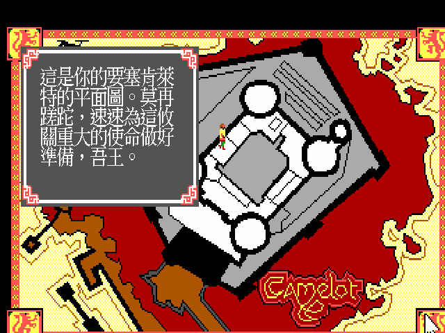

# 亞瑟王傳奇 — 尋找聖杯　繁體中文化

*Conquests of Camelot: The Search for the Grail*（Sierra On-Line, 1990）

你是亞瑟王。不列顛已在你手中統一，甘美的日子卻沒有來——旱象蔓延，疫病四起，
田裡長不出東西，人民在你的城牆外挨餓。宮廷裡的說法是：唯有找回聖杯，這片土地才能解咒。
高文、葛拉漢、蘭斯洛特三位圓桌武士先後出發尋訪，至今一去不返。

而你心裡清楚，詛咒的根源就在自己家裡——皇后昆海兒與蘭斯洛特之間的私情。
沒有人能代你去了。你得親自上馬，穿過危機四伏的派瑞樂斯森林，渡過地中海，
一路走到耶路撒冷的城門下。

這個專案把這條路上的每一句話翻成繁體中文：**4584 則對白與敘述**、選單、道具、
技能／智慧／靈魂三種分數的畫面。譯名以 1990 年《軟體世界》第 18、19 期的攻略為準，
用的是當年台灣玩家看到的名字（肯萊特、昆海兒、葛拉漢）；字形則直接取自
**倚天中文系統的原生點陣字**，不是現代字型縮小的——螢幕上看起來就是 1990 年代的中文 DOS 遊戲。

本專案**只提供 ScummVM 引擎修改與中文資料，不含任何遊戲檔案**，你需要自備正版遊戲。
想直接玩，跳到〈怎麼玩〉。

---

## 目前進度

這是進行中的專案。

| 項目 | 狀態 |
|---|---|
| 引擎中文化（Big5 繪字、640×400 hi-res 直繪） | ✅ 實機驗證通過 |
| 倚天點陣字管線（16×15 ＋ 24×24） | ✅ |
| 對白翻譯 | 🔄 進行中 |
| 選單／系統 UI | ✅ 已抽出並翻譯 |
| 標題中文疊圖 | ⬜ 未開始 |
| 打包（Linux／Windows／macOS） | ⬜ 未開始 |

## 這一版是什麼

| 項目 | 值 |
|---|---|
| 遊戲版本 | 1990 DOS EGA（`version` 檔 1.001.000） |
| 引擎 | Sierra SCI0（interpreter 0.000.685） |
| ScummVM game ID | `camelot` |
| 畫面 | 320×200 / 16 色 EGA；中文走 640×400 hi-res 直繪 |
| 音源 | AdLib 或 Roland MT-32（當年廣告就把 MT-32 列為賣點） |

本作只有這一個版本，沒有後來的 VGA 重製版。

## 怎麼玩

（打包完成後補上下載連結與步驟。）

## 這是 parser 遊戲

《亞瑟王傳奇》是用鍵盤打指令的冒險遊戲——`look at statue`、`ask about grail`、`buy herb`。
中文化的原則是：**看到的翻成中文，要打進去的維持英文**。
所以畫面上的敘述與對白都是中文，但你仍然要用英文下指令。

遇到必須打對英文才能過的關卡（湖中女神的 `Love is my shield`、謎語石、
神奇花叢、符號考驗、維納斯問答），譯文會在問句後就地附上英文答案，不會讓你卡在語言上。

## 技術文件

- [`CONTEXT.md`](CONTEXT.md) — 已驗證的引擎事實、踩過的坑
- [`docs/20-walkthrough-glossary.md`](docs/20-walkthrough-glossary.md) — 當年《軟體世界》攻略整理出的譯名總表、謎題答案、路線
- [`BUILD.md`](BUILD.md) — 從 patch 重建 ScummVM

## 當年在台灣

《亞瑟王傳奇》在台灣是接在《幻想空間》(Leisure Suit Larry) 與《英雄傳奇》(Quest for Glory)
之後上市的 Sierra 新作。當年的雜誌廣告把賣點歸納成三項：劇情考據（宮廷軼事、皇后與蘭斯洛特、
基督教與羅馬戰神的信仰之爭）、畫面（甘美特城堡舊蹟與古英國地圖）、音樂（魔奇音效卡與 MT-32
的「英國古風的音樂」）。規格是 IBM PC XT/AT、記憶體 512K、**10 片磁片**，類別寫「立體冒險」。

> 廣告與攻略掃描的權利不屬於本專案，此處只引用少量頁面作為時代註腳。
> 出處：《軟體世界》第 18 期 p.24–29、第 19 期 p.44–49。

## 授權與免責

- 本專案的程式碼與譯文以 ScummVM 的授權（GPLv3）發布。
- **不含任何遊戲資源**。原始遊戲的版權屬於 Sierra On-Line／其權利繼受者。
- MT-32 ROM 有版權，不隨本專案散布，需自備。
